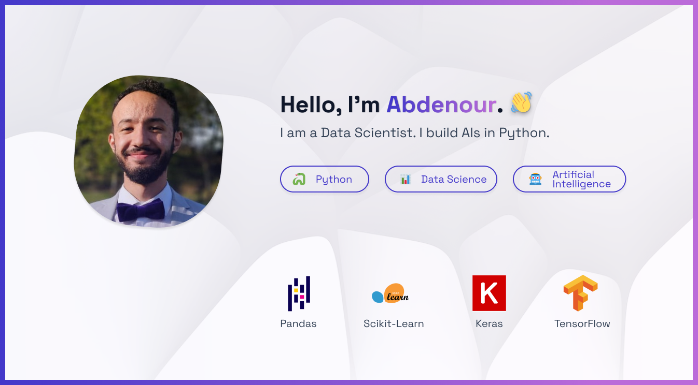

<!--
**Ab2nour/Ab2nour** is a ✨ _special_ ✨ repository because its `README.md` (this file) appears on your GitHub profile.

Here are some ideas to get you started:

- 🔭 I’m currently working on ...
- 🌱 I’m currently learning ...
- 👯 I’m looking to collaborate on ...
- 🤔 I’m looking for help with ...
- 💬 Ask me about ...
- 📫 How to reach me: ...
- 😄 Pronouns: ...
- ⚡ Fun fact: ...
-->

## Projet Compilation

Ce projet est la matérialisation de mon amour pour la compilation et les langages de programmation. J'ai développé un compilateur pour mon propre langage de programmation, démontrant ainsi ma maîtrise de Java et ma capacité à travailler sur des projets complexes.

[Lien vers le projet](https://github.com/votre-pseudo/projet-compilation)

## Projet Graphe

Ce projet montre mon expertise en algorithmes de graphes. J'ai créé un outil pour orienter un graphe non orienté en un graphe fortement connecté, démontrant ainsi ma capacité à résoudre des problèmes complexes en utilisant Python.

[Lien vers le projet](https://github.com/votre-pseudo/projet-graphe)

## Projet Clovis LaTeX

J'ai conçu ce projet pour simplifier la création de documents dans le style des fiches de révision Clovis. Mon expertise en LaTeX a été mise en avant pour créer cette bibliothèque, qui peut être précieuse pour toute personne travaillant avec LaTeX.

[Lien vers le projet](https://github.com/votre-pseudo/clovis-latex)

## Projet Transverse

Ce projet met en évidence ma capacité à analyser et à segmenter une clientèle pour des campagnes de marketing efficaces. En utilisant Python, j'ai réalisé une analyse approfondie des données client pour aider les entreprises à prendre des décisions éclairées.

[Lien vers le projet](https://github.com/votre-pseudo/projet-transverse)

## Contact

Si vous êtes impressionné par ces projets et que vous cherchez un développeur dédié et passionné, n'hésitez pas à me contacter. Je serais ravi de discuter de la manière dont je peux contribuer à votre entreprise ou à vos projets.

[Mon profil LinkedIn](https://www.linkedin.com/in/votre-pseudo)

Merci de visiter mon portfolio GitHub !

