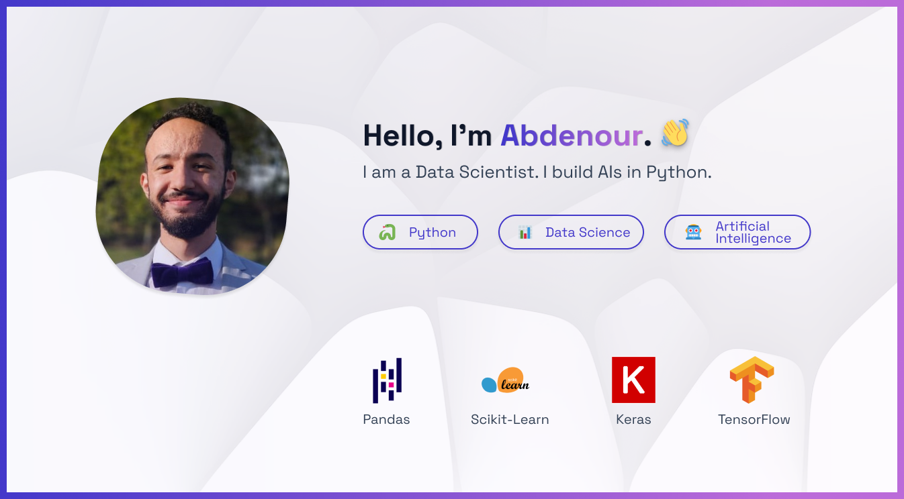

<!-- ## 🚀 About Me

- 🧑‍💻 Developer with a passion for building and exploring new technologies.
- 🏗️ I mostly do AI competitions, data science, and simulation models.
- 🛠️ Constantly tinkering, learning, and sharing open-source projects.-->

---

# 🏆 Highlighted Projects

## Competed in 8 Kaggle AI Competitions

|                                                                                             |                                                                                                                                 |
|:-------------------------------------------------------------------------------------------:|:-------------------------------------------------------------------------------------------------------------------------------:|
|                                                         |                         _**Best ranking 105/934**, using XGBoost, CatBoost, LightGBM, & Random Forests_                         |
| **Fig.** My Kaggle leaderboard, sorted by best results. I ranked 3 times among the top 33%. |  |

## Other
- 📈 <a href="https://github.com/Ab2nour/stock-analysis"><b>Stock Analysis</b></a>  
  Stock price analysis using time series methods. Interactive notebooks and visualizations!  
  <i>Jupyter Notebook, Time Series | <a href="https://ab2nour.github.io/stock-analysis/">Project Page</a></i>

- 🤖 <a href="https://github.com/Ab2nour/kaggle-competitions"><b>Kaggle Competitions</b></a>  
  My entries to various Kaggle AI competitions, exploring machine learning and data science.  
  <i>Jupyter Notebook, ML</i>

- 🦠 <a href="https://github.com/Ab2nour/epidemic-simulation"><b>Epidemic Simulation</b></a>  
  Simulating epidemics with the Galton-Watson model.  
  <i>Jupyter Notebook | <a href="https://ab2nour.github.io/epidemic-simulation/">Project Page</a></i>
  
- 🌟 <a href="https://github.com/Ab2nour/my-own-compiler"><b>My Own Compiler</b></a>  
  A full compiler for my own programming language — built with ANTLR4, featuring custom grammar, lexer, and parser.  
  <i>Java, ANTLR4 | <a href="https://ab2nour.github.io/my-own-compiler/">Project Page</a></i>

---

## 📊 More Cool Stuff

- <a href="https://github.com/Ab2nour/customer-base-analysis"><b>Customer Base Analysis</b></a> - Segmentation and marketing prediction.
- <a href="https://github.com/Ab2nour/jane-street"><b>Jane Street</b></a> - Quantitative experiments in Python & Jupyter.
- <a href="https://github.com/Ab2nour/create-new-words"><b>Create New Words</b></a> - Generate new words that sound statistically French!

_...and more! [See all my repositories.](https://github.com/Ab2nour?tab=repositories)_

---

## 📬 Let's Connect!

- 🌐 [GitHub Profile](https://github.com/Ab2nour)
- 🏠 [Personal Website](https://ab2nour.github.io/)

<!--
Talk about my

1) Data sciences projets
- survival analysis
etc

2) Software projects
- Clovis
- Folder Organization
- Graph

-->
