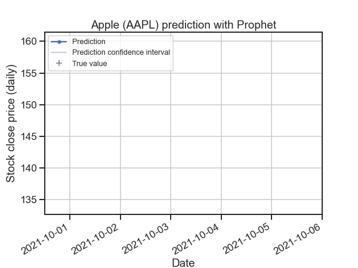
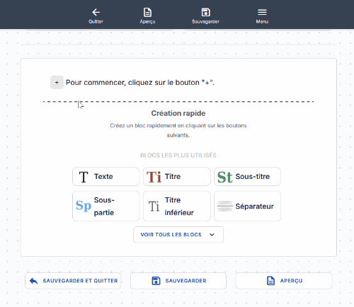
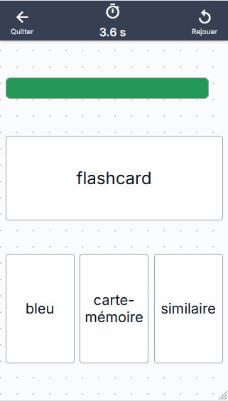
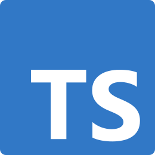
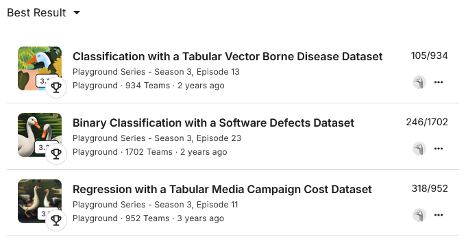

# Highlighted Projects

## Stock Analysis _[(link)](https://github.com/Ab2nour/stock-analysis)_

|                                                                                                          |                                                                                                                                                                                                                                                                                                                                                                |
|:--------------------------------------------------------------------------------------------------------:|:--------------------------------------------------------------------------------------------------------------------------------------------------------------------------------------------------------------------------------------------------------------------------------------------------------------------------------------------------------------:|
|                                                                      |                                                                                        Stock prices analysis & prediction using time series methods. I benchmarked **Prophet**, **XGBoost** & SARIMA models, and visualized the data on **interactive dashboards**.                                                                                         |
| **Fig.** Apple stock "close" prediction compared with actual value, done with Prophet model (from Meta). |  |

## Technological startup project: “Projet Clovis” _[(link)](https://student.projetclovis.fr/welcome.php)_

|                                                                                                                                                  |                                                                                                                                                                                                                                                                                                                                                                                                                                                                                                                                                                                                         |
|:------------------------------------------------------------------------------------------------------------------------------------------------:|:-------------------------------------------------------------------------------------------------------------------------------------------------------------------------------------------------------------------------------------------------------------------------------------------------------------------------------------------------------------------------------------------------------------------------------------------------------------------------------------------------------------------------------------------------------------------------------------------------------:|
|  
**Fig.** Document creation, with block-style editor: automatic styles to focus on content only.
  |                                                                                     • Built & scaled a **full-stack EdTech platform (mobile & web)** enabling students to create flashcards and study through interactive mini-games.  • Grew the platform to **350+ active users**, with **40,000+ flashcards** and **2,200+ study sheets** created.  • Pitched the project in front of 100+ people at major events (Le Village by CA, digiSchool HYPE Awards 2018), with a featured video on YouTube.                                                                                     |
|  
**Fig.** One of the mini-games to study your flashcards: choose the right answer in limited time.
 | 
• Led development over **7+ years**, from inception at 17 years old to a fully maintained large-scale project.  • Tech stack: **Python (Django)**, SQL, **TypeScript**, **React**, PHP.  • Managed databases & analytics: phpMyAdmin, Google Analytics for user insights.
 |

## Competed in 8 Kaggle AI Competitions _[(link)](https://www.kaggle.com/ab2nour/competitions)_

|                                                                                             |                                                                                                                                 |
|:-------------------------------------------------------------------------------------------:|:-------------------------------------------------------------------------------------------------------------------------------:|
|                                                         |                         _**Best ranking 105/934**, using XGBoost, CatBoost, LightGBM, & Random Forests_                         |
| **Fig.** My Kaggle leaderboard, sorted by best results. I ranked 3 times among the top 33%. |  |

## More...

Check more on my [personal portfolio](https://ab2nour.github.io/)!
